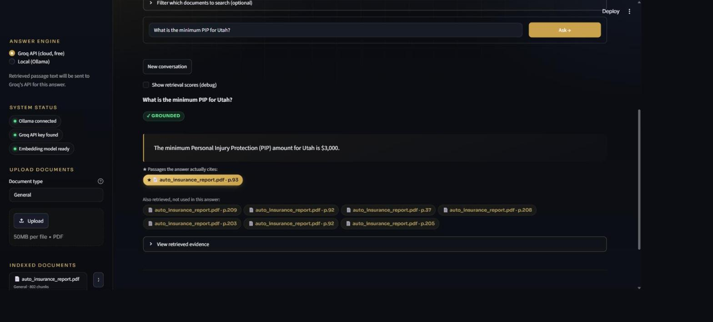
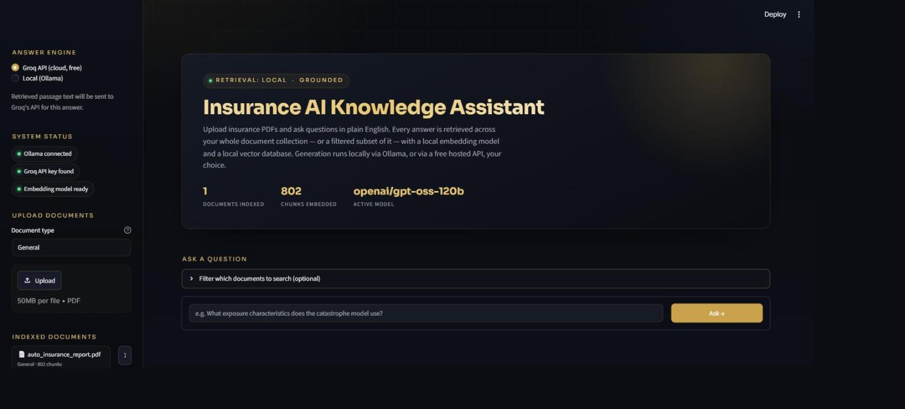
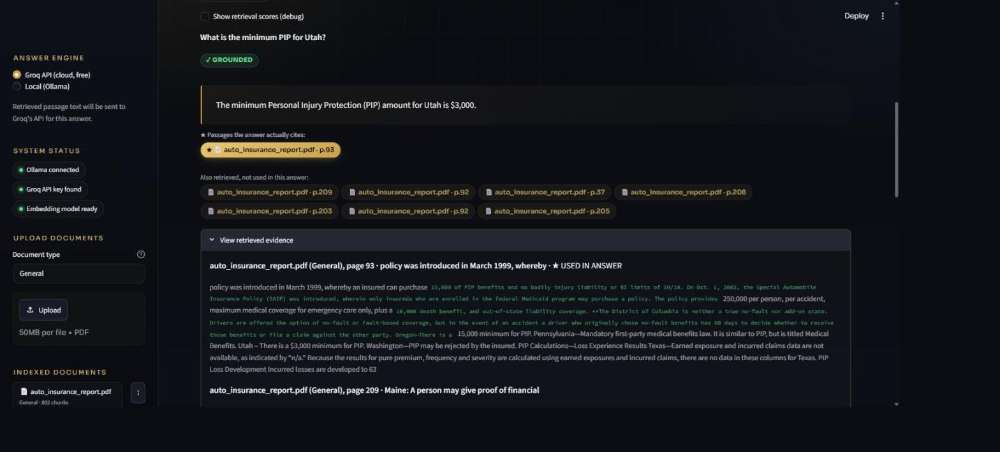

# Grounded Document Q&A — Retrieval-Augmented Generation

[](https://github.com/VJ1133/insurance-rag-assistant/actions/workflows/tests.yml)


Upload any PDF (contracts, policies, research papers, manuals, financial or regulatory reports) and ask questions in plain English. Answers are grounded in your documents, cited down to the page, and the assistant refuses when the documents don't support an answer.

The pipeline is domain-agnostic: nothing in parsing, chunking, retrieval, or generation is tied to a particular subject. It was developed and evaluated on insurance and regulatory reports because their dense, multi-column tables are a hard stress test for RAG.

The project focuses on the parts of RAG that are hard to get right in practice: extracting text from table-heavy PDFs, retrieval that holds up on repetitive tabular content, verifiable citations, and measuring quality with an evaluation set instead of spot-checking.



---

## Results

Measured on insurance and regulatory reports, using the evaluation set in [`eval/cases.json`](eval/cases.json) with [`scripts/run_eval.py`](scripts/run_eval.py):

| Metric | Before | After |
|---|---|---|
| Retrieval MRR | 0.25 (hybrid only) | **0.90** (hybrid + cross-encoder reranking) |
| Average rank of the correct page | ~4 | **~1.1** |
| Answer accuracy (Groq generation) | — | **7 / 7** |

Answer accuracy checks that required values appear, known-wrong values do not, and out-of-scope questions are refused.

**A bug found through evaluation.** On a report with a flattened multi-column table, the pipeline answered "Earned Premium" questions using the adjacent "Earned Exposure" column. The fix had two parts: a prompt rule describing column-group order, and a code-level guard (`src/evaluation.py::unsupported_numbers`) that flags any number in an answer that doesn't appear in the retrieved passages. A regression test now covers the case. Full write-up in [`CHANGELOG.md`](CHANGELOG.md).

---

## Features

- **Works with any PDF**: text, multi-column layouts, and tables are parsed the same way regardless of subject.
- **Multi-document ingestion** with user-defined document types and filtering by type or by document.
- **Layout-aware PDF extraction** (PyMuPDF) that preserves column and table reading order.
- **Hybrid retrieval**: semantic search (MiniLM embeddings in ChromaDB) and BM25 keyword search, combined with Reciprocal Rank Fusion, then reranked by a cross-encoder.
- **Grounded answers**: each answer carries a real `grounded` flag, and the model refuses when the retrieved context is insufficient.
- **Passage-level citations**: the model reports which passages it used through a structured trailer; the UI highlights those passages and dims retrieved-but-unused ones.
- **Two generation backends**, switchable per question: local Ollama (`gemma3:4b`, fully private) or Groq (`openai/gpt-oss-120b`, stronger on dense tables).
- **FastAPI service** sharing the same vector store as the Streamlit UI.
- **Structured per-question logging** for debugging retrieval and generation.
- **Docker Compose deployment** with models downloaded at build time.
- **CI**: unit tests run on every push via GitHub Actions.

---

## Architecture

```
PDF upload ──▶ PyMuPDF extraction (column/table-aware)
                 │
                 ▼
           Chunking (overlapping, per page)
           + metadata: document, type, page, section
                 │
                 ▼
     Sentence Transformers (all-MiniLM-L6-v2)
                 │
                 ▼
         ChromaDB (persistent, local)

Question ──▶ Semantic search ─┐
         └─▶ BM25 search ─────┴─▶ Reciprocal Rank Fusion ─▶ Cross-encoder rerank
                                                                    │
                                                                    ▼
                                   LLM (Ollama or Groq), context-only prompt
                                                                    │
                                                                    ▼
                                 Answer + grounded flag + cited passages
                                 + unsupported-number check
```

Ingestion, embeddings, retrieval, and reranking always run locally. Only the final generation call leaves the machine, and only when Groq is selected.

---

## Key engineering decisions

**Why hybrid retrieval.** On an insurance report containing a large state-by-state table, the question "What is the minimum PIP for Utah?" failed with semantic search alone: the right chunk contained many states, so its embedding wasn't specifically "about Utah." It didn't appear in the top 15 of 828 chunks. Adding BM25 moved it to rank 3. RRF fuses rank orderings instead of raw scores, since cosine distance and BM25 scores aren't on comparable scales.

**Why add a reranker.** Hybrid retrieval got the right passage into the candidate set, but often not near the top. A cross-encoder scores each question–passage pair jointly, which raised MRR from 0.25 to 0.90.

**Why a numeric faithfulness check.** A refusal check can't catch a confident answer built from the wrong table cell. Verifying that every number in the answer exists in the retrieved text catches that class of error cheaply and deterministically.

**Why keep citations out of the answer text.** The model reports used passages in a machine-readable trailer (`USED_PASSAGES: 1,3`) that the app parses and removes. The UI renders citations from that, so the prose and the citation list can't disagree.

---

## Quick start

### Docker (recommended)

```bash
cp .env.example .env          # add your GROQ_API_KEY
docker compose up --build
```

- Streamlit UI: http://localhost:8501
- API docs: http://localhost:8000/docs

The Docker image is Groq-only (`ALLOW_OLLAMA=false`), since a deployed container has no local Ollama to reach. `.env` is excluded by `.dockerignore` and never baked into the image.

### Local

```bash
python -m venv venv
source venv/bin/activate      # Windows: venv\Scripts\activate
pip install -r requirements.txt
```

Configure at least one generation provider:

- **Ollama (local, private):** `ollama pull gemma3:4b`, then make sure it's reachable on `localhost:11434`.
- **Groq (hosted):** create a free key at [console.groq.com](https://console.groq.com) and add `GROQ_API_KEY=...` to `.env`.

The app uses Groq if a key is present and falls back to Ollama otherwise. You can switch in the sidebar.

```bash
python scripts/make_sample_pdf.py   # optional synthetic test document
streamlit run app/app.py
```

---

## API

```bash
uvicorn api.main:app --reload --port 8000
```

| Method | Endpoint | Description |
|---|---|---|
| `GET` | `/health` | Service and provider status |
| `GET` | `/documents` | List indexed documents |
| `POST` | `/documents` | Upload and index a PDF (multipart) |
| `DELETE` | `/documents/{name}` | Remove a document from the index |
| `POST` | `/ask` | Ask a question; returns answer, grounded flag, and citations |

---

## Evaluation and testing

```bash
pytest                              # unit tests (also run in CI)
python scripts/run_eval.py          # retrieval MRR and answer accuracy on eval/cases.json
python scripts/test_grounding.py    # grounded vs. refused behavior against a live LLM
```

Debugging utilities:

- `scripts/debug_retrieval.py` shows ranked retrieval results for a question.
- `scripts/debug_page_extraction.py` flags pages likely to have lost content to images.

---

## Screenshots

| | |
|---|---|
|  |  |
| Sidebar with system status, indexed documents, and provider toggle. | Evidence panel with the cited passage marked and unused passages dimmed. |

---

## Project structure

```
grounded-document-qa/
├── app/
│   ├── app.py                  # Streamlit UI
│   └── assets/styles.css
├── api/
│   └── main.py                 # FastAPI service
├── src/
│   ├── document_loader.py      # Layout-aware PDF extraction
│   ├── chunker.py              # Overlapping, page-level chunking
│   ├── embeddings.py           # Sentence Transformers wrapper
│   ├── vector_store.py         # ChromaDB + BM25 hybrid retrieval
│   ├── rag_pipeline.py         # Retrieval, reranking, generation
│   └── evaluation.py           # Metrics and faithfulness checks
├── eval/cases.json             # Evaluation set
├── scripts/                    # Eval, grounding tests, debugging tools
├── tests/                      # pytest suite
├── docs/screenshots/
├── Dockerfile
├── docker-compose.yml
├── CHANGELOG.md
└── requirements.txt
```

---

## Limitations and next steps

- **Small evaluation set.** Seven cases show the approach works but aren't statistically strong. The current set covers insurance and regulatory reports; expanding to 50+ cases across other domains (legal, technical, academic) is the next priority.
- **Fixed-size chunking.** Chunks are split by word count, not by semantic or table boundaries. Table-aware chunking would likely help most on dense reports.
- **BM25 index rebuilt per query.** Fine at a few thousand chunks, but a larger corpus needs a persistent keyword index.
- **Refusal detection is string-based.** The `grounded` flag depends on the model using an exact refusal message.
- **Citations depend on model compliance.** If the model omits the `USED_PASSAGES` trailer, the UI falls back to showing all passages equally rather than failing.
- **Local model accuracy.** `gemma3:4b` is noticeably weaker than the Groq model on precise table lookups.
- **PDF only.** Scanned or image-only PDFs need OCR, which isn't included yet. Word, HTML, and other formats aren't supported.
- **Heuristic section detection.** Only the first heading on each page is captured.

---

## Privacy

Parsing, embeddings, retrieval, and reranking always run locally. With Ollama, nothing leaves the machine. With Groq, only the retrieved passages for a given question are sent to Groq's API. Don't upload documents you don't have permission to process, or send confidential material through the Groq option.
